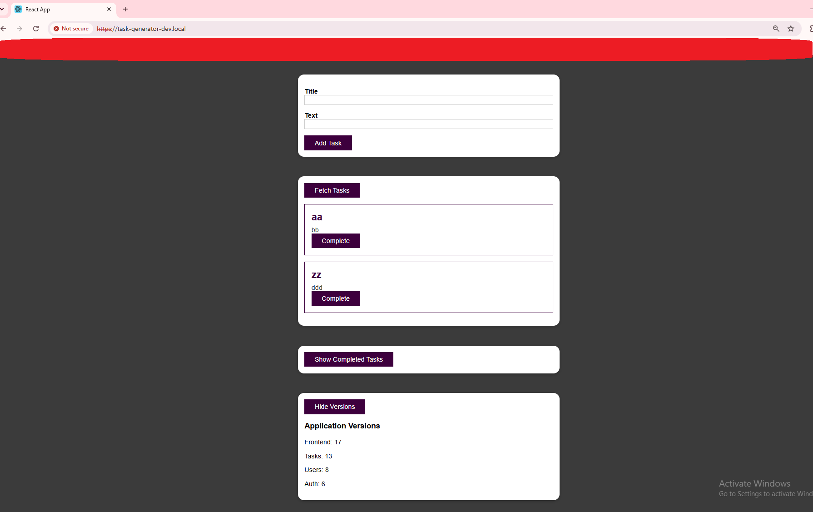
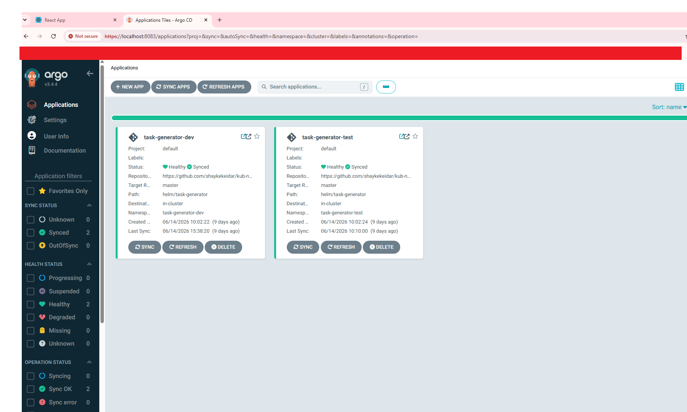
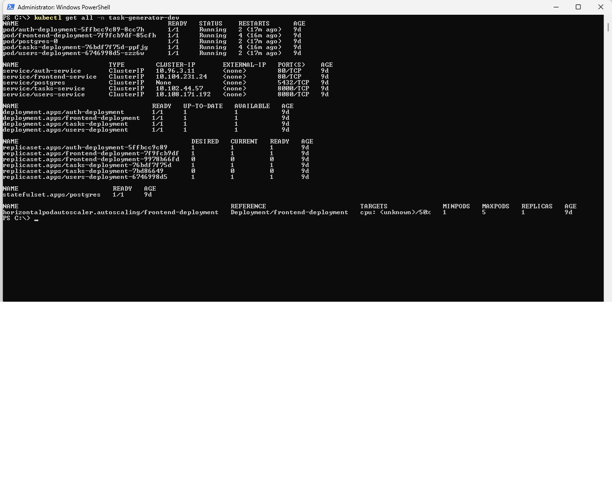
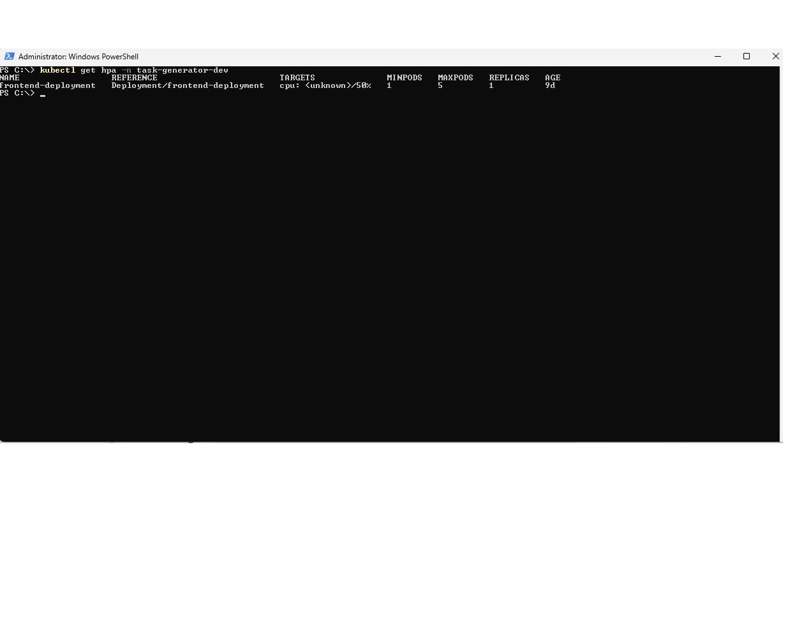
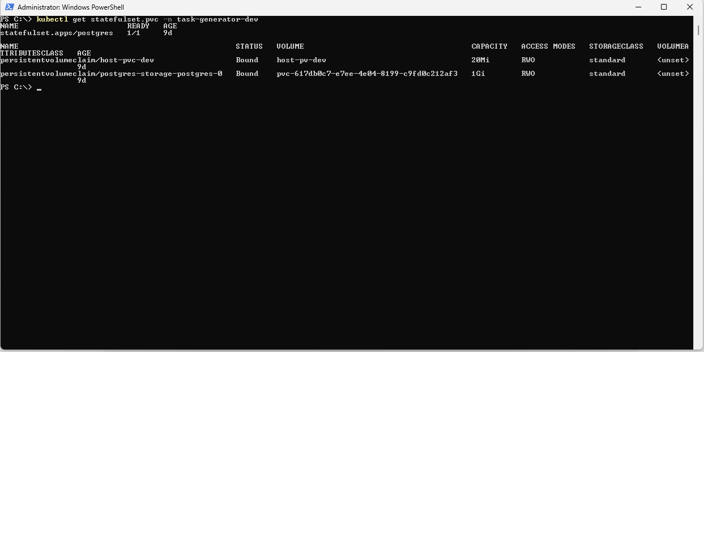

# Architecture

## Overview

Task Management Platform is a cloud-native task management application migrated from a Docker-based deployment model to Kubernetes.

The project demonstrates Kubernetes application deployment using Helm, ArgoCD, PostgreSQL, Ingress, ConfigMaps, Secrets, Persistent Volumes, and environment-based namespaces.

## Main Components

* React Frontend
* Node.js Backend Services
* PostgreSQL Database
* Kubernetes Deployments
* Kubernetes Services
* Kubernetes Ingress
* Helm Chart
* ArgoCD GitOps Deployment
* ConfigMaps
* Secrets
* Persistent Volume Claims
* Horizontal Pod Autoscaling

## Logical Architecture

```text
User
  ↓
Ingress
  ↓
Frontend Service
  ↓
Frontend Pod
  ↓
Backend Services
  ↓
PostgreSQL Service
  ↓
PostgreSQL StatefulSet
  ↓
Persistent Volume Claim
```

## Kubernetes Structure

```text
Namespaces:
- task-generator-dev
- task-generator-test

Application Components:
- frontend
- users service
- auth service
- tasks service
- PostgreSQL
```

## Deployment Flow

```text
GitHub Repository
  ↓
ArgoCD
  ↓
Helm Chart
  ↓
Kubernetes Cluster
  ↓
Application Pods
```

## Key DevOps Concepts Demonstrated

* Docker to Kubernetes migration
* GitOps deployment with ArgoCD
* Helm-based deployment management
* Environment separation using namespaces
* PostgreSQL integration
* Persistent storage with PVC
* Kubernetes Ingress
* ConfigMaps and Secrets
* Horizontal Pod Autoscaling

```
```

## Screenshots

### Application



### ArgoCD



### Kubernetes Resources



### Horizontal Pod Autoscaler



### PostgreSQL Storage

